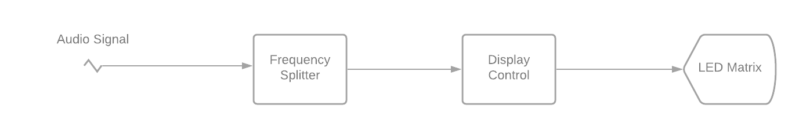

# Spectrum Analyzer
A simple arduino based spectrum analyzer that splits incoming audio into 7 frequency bands and displays the amplitude in the form of bars on a Matrix LED.

## Inspiration 
I have always been mesmerized by lights synced to music. I had always wanted to make something that would react to music but lacked the mathematical background to understand how it to implement it. For my Sept, 2020 term, I took a course called Signals and Systems I at Ryeron University. Once I learned about analysing signals using fourier transforms and fourier series, I immediately began work on this spectrum analyzer. While it is only the first iteration, I intend to continue working on this project to explore the concept further. 

## Design and Implementation

  ### Block Diagram 
  The following diagram outlines a very simple model for the overall system design without any specific implementation details.
  
    
  ### Parts List
  * DFRobot Audio Analyzer Module 
    * This module splits any income signal into 7 freqeuncy bands and peak detects each band using the MSGEQ7 graphic equalizer display filter. The output is a multiplexed               analog signal
  * Arduino Uno 
    * I had an old one lying around so I decided to use this as the controller and implemented the control algorithm
  *BTF Lighting 64 x 64 ws2812B matrix
    * I chose this because the ws2812B are very easy to control and the matrix form factor means I don't have to do additional soldering to connect strips
  * A couple of capacitors, resistors and diodes and switches
    * This was mainly to filter any noise in the power supply and data lines and general circuit protection
## The Result 
  
## Thoughts
   When I have a bit more time, I intend on taking this from a basic spectrum analyzer with vertical bars to creating some cool arbitrary patterns that react to music. Adding        support for mode switching and even eliminate the DFRobot module entirely by using FFT algorithms. I also intend on writing a complete tutorial. Feel free to visit the repo,      critique my code, fork the project and improve it.    
